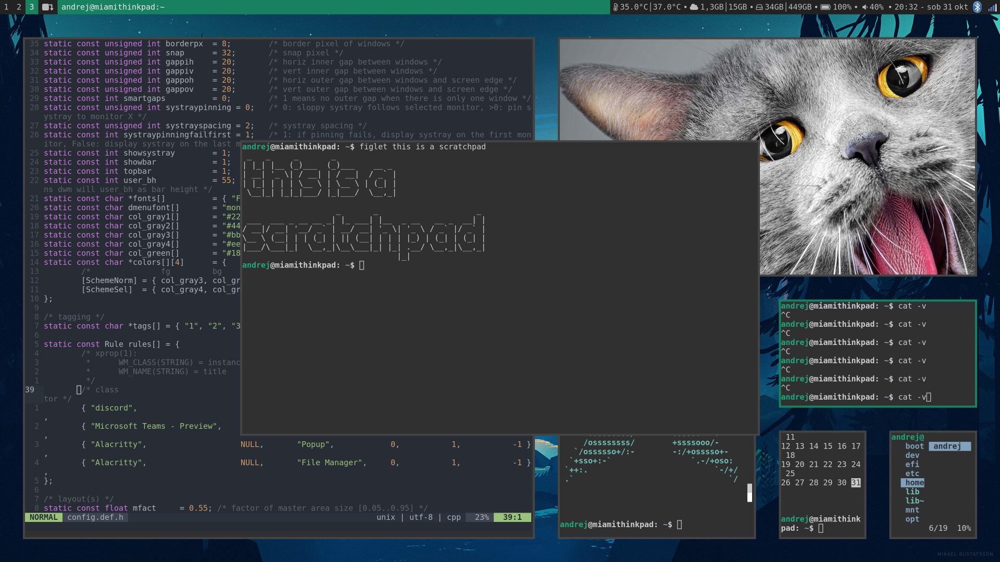

# Andrej's dwm

## What is dwm?
Its Suckless.org's window manager (minimalist code + source code is a config file). Because of this it is fast, reliable and has a lot of features (patch anything you like).

## My build
I like the simple yet practical look of my window managers (or desktop enviroments), so my build is patched only with patches I really like. The resizable gaps with multiple layouts are practical, because I believe that sometimes you need to look at something in a small window for it to make sense. For the colorscheme i like soft colors, but they also need to be seen clearly - I think that this green color is perfect for that. For the status bar I use ```dwmblocks``` because it's basically the same as i3blocks, which I used before on i3 plus it enables clickable modules.

## Installation
Just clone this repository and run:<br/>
```make install```<br/>
I also use font awesome icons for displaying the current layout (i don't like color emojis). If you are on Arch, install the font with:<br/>
```pacman -S ttf-font-awesome```

## Patches
My build is patched with:
- ```vanitygaps```, which comes with all sorts of layouts and enables gaps for them. I only use a few of these layouts (my favourite and default is "dwindle" - like fibonacci but more practical in my opinion), so i usually comment out the ones I don't use in the source code (```vanitygaps.c```). The resizable gaps are also very handy.
- ```attachdirection``` enables the new window to be opened to the right (a bit like i3). I find this to be more practical in most cases.
- ```hide-vacant-tags``` just hides the tags that have no windows open (also like i3)
- ```scratchpad``` is a really practical tool for those moments when you need to open a terminal for "just this simple thing"
- ```systray``` just adds the system tray icons
- ```bar-height``` is here because sys-tray icons were a bit cropped. Also I think it looks better just a bit wider (:.
- ```float-border-color``` just lets me quickly see which windows are floating.
- ```statuscmd-signal``` enables me to have a clickable status bar.

## Screenshot


